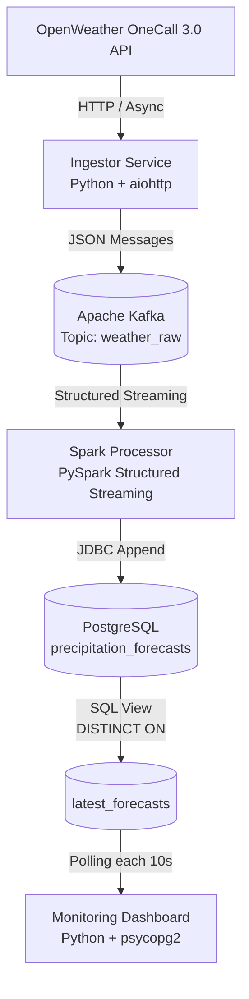

# Weather Precipitation Stream Processor

## 1. Executive Summary

This application is a production-grade streaming pipeline designed to ingest, process, and expose real-time precipitation forecasts. Built for **Sensorfact**, the system demonstrates a decoupled architecture that balances the strict constraints of external API rate limits (60 calls/min) with the heavy-lifting requirements of Big Data stream processing (Spark/Kafka).

The system answers the core question:

> **“How much rain will fall in the coming hour at our locations?”**

It does so by aggregating minute-by-minute precipitation forecasts into a single, actionable metric per location.

---

## 2. Architecture & Data Flow


### 2.1 The Pipeline Journey

**Ingestion (Async Python)**  
A high-performance `asyncio` service polls the OpenWeatherMap OneCall 3.0 API.  
It uses staggered scheduling to spread 50+ requests across a 60-second window, avoiding burst-rate limit violations.

**Buffering (Kafka)**  
Raw JSON API responses are produced to the `weather_raw` Kafka topic.  
Kafka acts as a durable buffer, providing fault tolerance—if downstream processing fails, data is retained and replayable.

**Transformation (Spark Structured Streaming)**  
A PySpark Structured Streaming application consumes data from Kafka.  
It:
- Parses and validates the JSON payload
- Explodes the `minutely` forecast array
- Aggregates `SUM(precipitation)` over the next 60 minutes

**Storage (PostgreSQL)**  
Processed results are written via JDBC in **append mode**, preserving historical forecast snapshots.  
A database view using `DISTINCT ON` exposes the **latest forecast per location** for real-time querying.

**Exposing (Monitoring)**  
A terminal-based dashboard queries the “latest state” view every 10 seconds, providing low-latency visibility into upcoming precipitation.

---

### 2.2 System Timing Logic

| Component     | Frequency | Rationale                             |
|---------------|-----------|---------------------------------------|
| Ingestion     | 60s       | Matches OpenWeather structural update |
| Processing    | 2–5s      | Spark micro-batch latency             |
| Monitoring    | 10s       | Minimizes perceived UI lag            |

---

## 3. Key Design Considerations

### 3.1 Flexibility & Pragmatism

**Decoupled Services**  
The ingestion and processing layers are independent. This allows processing logic (e.g., changing aggregation semantics) to evolve without interrupting data collection.

**Schema Enforcement**  
A strict `StructType` schema is applied in Spark. Invalid or malformed API responses are rejected early, preventing corrupt data from reaching the database.

---

### 3.2 Scalability (The 10k+ Coordinate Strategy)

The architecture is designed to scale well beyond the current ~50 locations:

**Kafka Partitioning**  
Increasing topic partitions enables parallel consumption across Spark executors.

**Distributed Ingestion**  
The ingestor can be horizontally sharded. For example, 10 workers polling 1,000 locations each instead of a single monolith polling 10,000.

**Spark on Kubernetes**  
Although currently deployed via Docker Compose, the Spark job is compatible with Kubernetes for horizontal and elastic scaling.

---

### 3.3 Fault Tolerance

**Checkpointing**  
Spark maintains checkpoints under `/tmp/checkpoints`. If the processor crashes, it resumes from the last committed Kafka offsets, ensuring no data loss.

**Backpressure Handling**  
Spark Structured Streaming automatically regulates ingestion rates. Sudden spikes in data volume are handled via controlled micro-batches, preventing memory exhaustion.

---

## 4. Setup & Execution

### Prerequisites

- Docker
- Docker Compose
- OpenWeatherMap API Key (OneCall 3.0 enabled)

---

### Launching the Stack

```bash
# 1. Provide your API Key
echo "OPENWEATHER_API_KEY=your_key_here" > ingestor.env

# 2. Build and start all services
docker-compose up --build
```
### Accessing the Data

#### Live Monitor (Recommended)

The monitor requires the psycopg2-binary package to communicate with the database.
```bash
# Install dependency
pip install psycopg2-binary

# Run the monitor
python monitor.py

```
#### Direct SQL Access


```bash
docker exec -it weather-db \
  psql -U sensorfact -d weather_db \
  -c "SELECT DISTINCT ON (location_name) location_name, total_next_hour_mm, forecast_window_start FROM precipitation_forecasts ORDER BY location_name, forecast_window_start DESC;"
```

